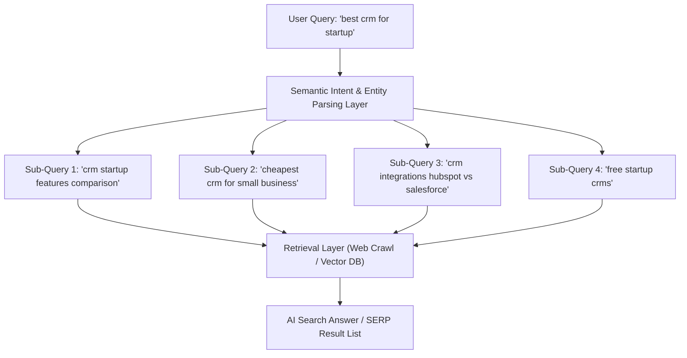

# Query Fan-Out & Semantic Intent Optimization

This reference guide details the concept of **Query Fan-Out** in search engines and AI retrieval architectures, and defines the auditing guidelines to ensure a site's content satisfies fanned-out query networks.

---

## 1. What is Query Fan-Out?

**Query Fan-Out** is the process by which a search engine, RAG aggregator, or AI agent takes a single user-entered query and expands it (fans it out) into multiple distinct sub-queries, semantic variations, or entity-based context requests.

### Why Search Systems Fan Out Queries
* **Intent Ambiguity:** A user typing "best building products in India" might want manufacturer lists, pricing models, certification details, or supplier contact information.
* **Topical Completeness:** To construct a comprehensive summary (especially for Google AI Overviews, Perplexity, or OpenAI Search), the retriever must pull information from different web documents that address various facets of the topic.
* **Entity Relationship Mapping:** Modern search uses Knowledge Graphs. A query about a brand entity will trigger fan-out searches for its founders, headquarters, core products, parent company, and reputation metrics.

---

## 2. The Mechanics of Fan-Out Expansion

When auditing a page's topical coverage, you must anticipate the four main types of semantic fan-out queries:

| Fan-Out Type | Description | Target Keywords & Structures |
|---|---|---|
| **Direct Intent Expansion** | Synonyms, lexical matches, and natural language variants. | "crm system" $\rightarrow$ "customer relationship software", "lead manager". |
| **Faceted Intent Drilling** | Splitting the query into parameters like Price, Scale, Location, or Use Case. | "best crm" $\rightarrow$ "crm under $50", "crm for real estate". |
| **Comparative Expansion** | Automatically searching for vs/alternatives of entities. | "brand A" $\rightarrow$ "brand A vs brand B", "alternatives to brand A". |
| **Temporal & Contextual** | Appending temporal indicators (e.g., current year) or location proximity. | "top steel suppliers" $\rightarrow$ "top steel suppliers in India 2026". |

---

## 3. Auditing Content for Fan-Out SAT (Satisfaction)

To audit whether a page or group of pages satisfies a fanned-out query network, the auditing agent must review:

### 📑 A. Topical Authority & Semantic Clustering
* **Parent-Child Hub Structure:** Ensure that a high-level topic (e.g., "Building Materials") has dedicated child pages for its fanned-out subtopics ("Structural Steel", "AAC Blocks", "Cement Grades") rather than attempting to rank a single giant page for all intents.
* **Internal Linking Flow:** The parent page must link directly to the child subtopic pages with descriptive anchor texts containing fanned-out keywords.

### 📐 B. On-Page Semantic Depth
* **Heading Hierarchy Alignment:** Section headers (`<h2>`, `<h3>`) must address the common fanned-out queries. If the main topic is "AAC Blocks", sub-headings must answer:
  * `<h2>What is the cost of AAC blocks?</h2>` (Faceted - Price)
  * `<h2>AAC Blocks vs Red Clay Bricks</h2>` (Comparative)
  * `<h2>AAC Blocks Load Bearing Capacity</h2>` (Technical/Faceted)
* **FAQ Micro-Formatting:** Include structured Q&A paragraphs using `
` tags or standard HTML heading-paragraph pairs, wrapped in `FAQPage` schema.

---

## 4. Verification & Mapping Tools

To verify that the audit covers a site's relevant fan-out query profiles:

1. **Google Search Console (GSC) Query Analysis:**
   * Look at the long-tail search queries driving impressions to a single page.
   * If a page is getting impressions for fanned-out queries (e.g., "how to install X") but zero clicks, the content is missing the specific answers needed.
2. **People Also Ask (PAA) Scraped Lists:**
   * Scrape the PAA box for the target root keyword. The top 4–10 PAA questions represent Google's active algorithmic query fan-out.
3. **Keyword Proximity Analysis:**
   * Use Semrush or Ahrefs to isolate the "Keyword Magic" questions clustered around the brand or core product entity.
